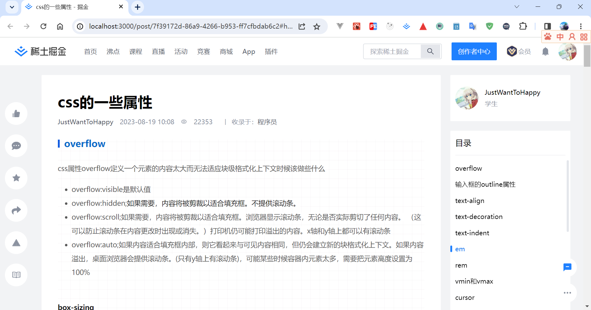

# 介绍
当作next练手了~
# 开始
1. 安装依赖：yarn install
2. 运行迁移文件：npx prisma migrate deploy
3. 初始化表数据：npx prisma db seed
4. 在根目录下创建.env文件,格式参考.env.example
5. 启动项目:yarn run dev
# 技术栈
- 语言:TypeScript
- 框架:Nextjs
- 包管理器:yarn
- 样式:tailwind
- 状态管理:zustand
- 代码风格:Eslint、Prettier
- ORM框架:prisma
- 身份认证:next-auth
# 预览

